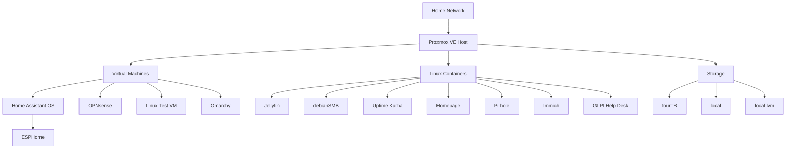
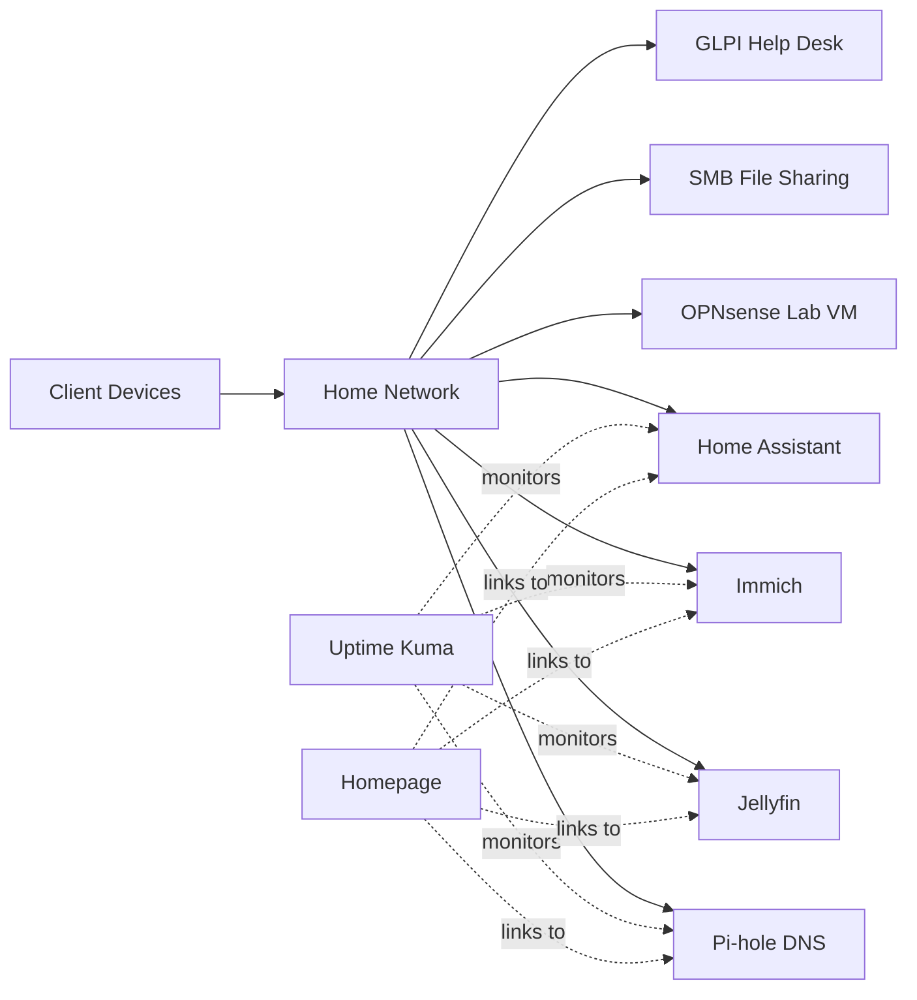

# Homelab Diagrams

This folder contains text-based and Mermaid-style diagrams of the homelab. The diagrams are intentionally sanitized and do not include private IP addresses, subnets, credentials, or externally reachable endpoints.

## Proxmox Workload Layout

```text
pve (Proxmox VE)
|
+-- VMs
|   +-- 100  haos18-2   [Home Assistant OS]
|   +-- 105  opnsense   [Firewall / networking lab]
|   +-- 106  test       [Linux test VM]
|   +-- 107  Omarchy    [Linux desktop VM]
|
+-- LXCs
|   +-- 101  jellyfin   [Media]
|   +-- 102  debianSMB  [File sharing]
|   +-- 103  uptimekuma [Monitoring]
|   +-- 104  homepage   [Dashboard]
|   +-- 108  pihole     [DNS filtering]
|   +-- 109  immich     [Photos]
|   +-- 112  glpi       [ITSM / Help Desk training]
|
+-- Storage
    +-- fourTB
    +-- local
    +-- local-lvm
```

## Functional Architecture



## Network-Service View



These diagrams represent the logical structure of the lab rather than the exact live network topology.
